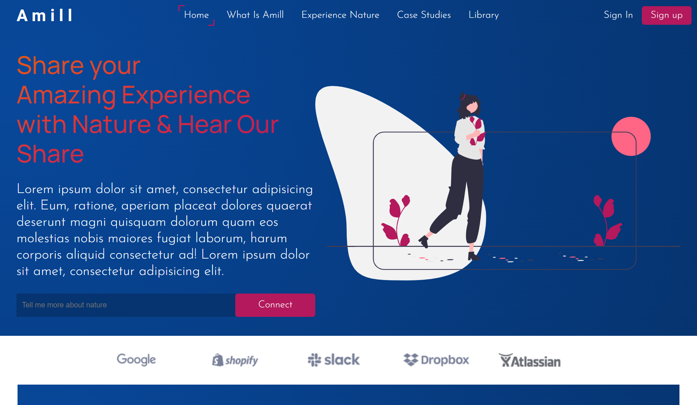

# Netlify Link

- https://react-amill.netlify.app

# React Amill

A Simple website uniting humans with nature built with React JS

# Steps to use Application

<li> Download Entire code
<li>
  
# Technologies Used  
<li> JSX
<li> CSS [ Styling ]
<li> React Icons [ Icons ]
<li> Undraw.co [Project Images]
<li> React JS [ Logic / Functionality / Rendering ]
